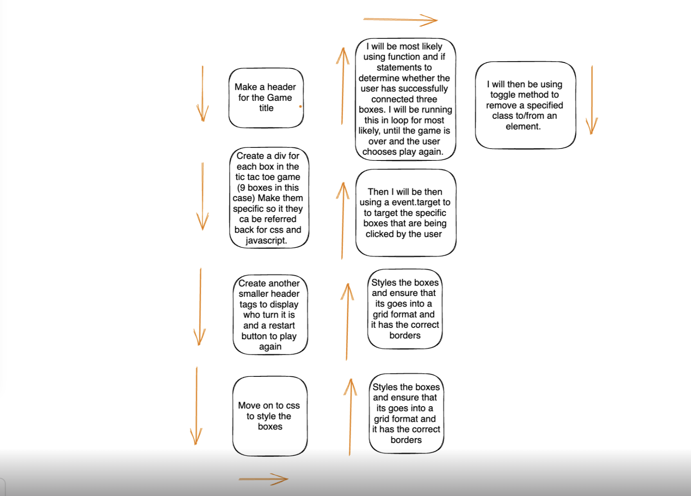

# tic-tac-toe
### [Play tic-tac-toe](https://josephnijo12.github.io/tic-tac-toe/)
ABOUT
This project is basically, a mulitplayer tic tac toe game, that allows the users to see who is the better tic tac toe player. To play this game all you need to do is click inside the assigned sqaures and take turns with X and O until its a tie or a player wins. 

## Planning and problem solving
There was problems along the, one of the problems were that when player X wins it would display that player O has won and when player O wins it would display player X has won. I solved this problem by, figuring out that I was calling the functions in the incorrect order. Furthermore, another problem I faced was when there was a draw, it would display on the screen. To combact this problme I created a loop that would check if all the sqaure were emppty if it wasn't would return tie. I ensured to put this at the end of the code, so it will only run after it has checked the winning combinations. 
 

## Cool tech 
The programming languages I used where Java script. CSS was also used, to style the board. I used a loop method to display and draw on the screen. Furthemore, to determine the winning combination I used if statements and documentQuearySelector to target the specfifed box. 

## Bugs to fix 
A thing to fix, would be to not allow the user to continue playing once a winner is displayed. 

## Lessons learnt
One lesson I have learnt to do is always check for the minor details, such as spelling and the order in which the code is written.

## Future Features
Somethings I would like to add in the future would be to have a background music playing the nackground. Furthermore, I would have liked to add an animations when the player won. 

